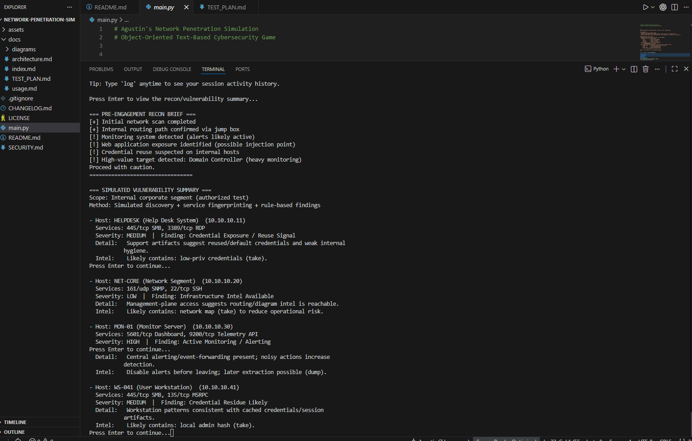
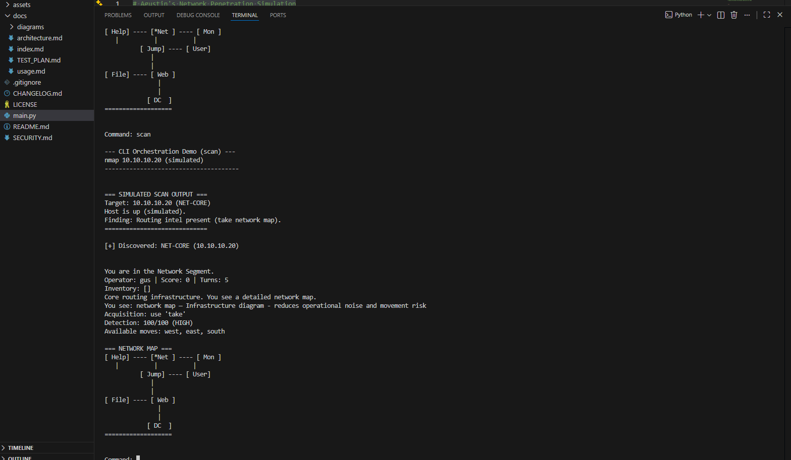

<p align="center">
  <br>
  
  
  
</p>

# Cyber Penetration Sim

A text-based cybersecurity red team simulation written in Python.

This project simulates an authorized internal penetration test where the player navigates a corporate network, collects required artifacts, manages detection risk, disables monitoring systems, discovers hosts, and attempts to compromise the final target.

All commands are simulated.  
No real tools or system commands are executed.

---

## Features

- CLI-based interactive gameplay
- Object-oriented (OOP) structure
- Detection and scoring mechanics
- Artifact acquisition with prerequisites
- In-memory session logging (no external files created)
- Simulated command execution output
- Host discovery system (scan / hosts / hosts clear)
- Linux-style ping command simulation
- Room-based network reachability logic
- Detection noise vs progress mechanics
- Final target validation logic
- Manual functional test plan included

---


## Screenshots

<table>
  <tr>
    <td align="center">
      <br>
      <sub><b>Gameplay</b></sub>
    </td>
    <td align="center">
      <br>
      <sub><b>Scan Example</b></sub>
    </td>
  </tr>
</table>


---

## How to Run

Clone the repository:

```bash
git clone https://github.com/guty09/network-penetration-sim.git
cd network-penetration-sim
python main.py
```

Requires Python 3.9 or newer.

---

## Testing

Manual functional testing is documented in detail.

See:

```
docs/TEST_PLAN.md
```

The test plan verifies:

- command parsing
- navigation rules
- artifact logic
- detection mechanics
- scoring
- session log
- host discovery
- ping simulation
- endgame validation
